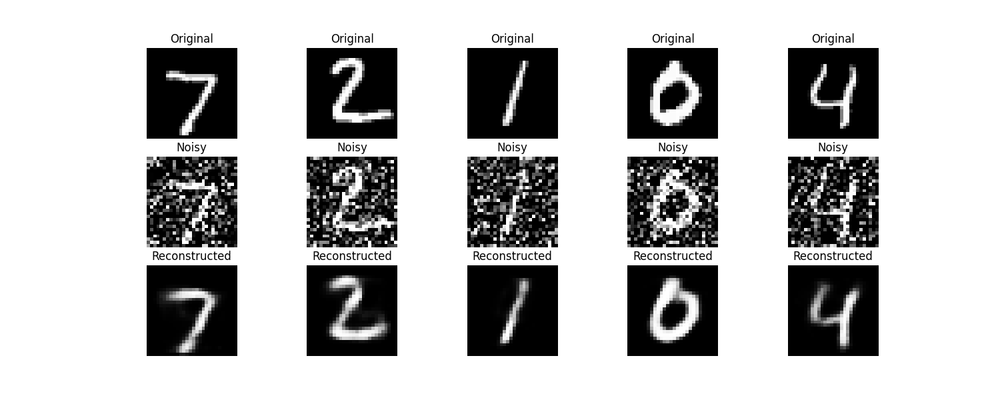

[Back Home](../README.md)

# Denoising Autoencoder Project

This project implements a Denoising Autoencoder (DAE) using TensorFlow to reconstruct clean images from noisy inputs. The model is trained on the MNIST dataset and includes logging functionality for monitoring progress.



## Log Output

<pre>
2025-03-30 16:58:35,339 - INFO ->>> Logging initialized. Logs will be saved to: /home/vijay/my_github_projects/autoencoders-phase1/log_file/autoencoder-phase1.log
2025-03-30 16:58:36,909 - INFO ->>> Staring Denoising Auto Encoding ...
2025-03-30 16:58:44,707 - INFO ->>> Epoch 1/30, Loss: 0.0625
2025-03-30 16:58:51,521 - INFO ->>> Epoch 2/30, Loss: 0.0346
2025-03-30 16:58:58,292 - INFO ->>> Epoch 3/30, Loss: 0.0292
2025-03-30 16:59:05,001 - INFO ->>> Epoch 4/30, Loss: 0.0268
2025-03-30 16:59:11,770 - INFO ->>> Epoch 5/30, Loss: 0.0249
2025-03-30 16:59:18,578 - INFO ->>> Epoch 6/30, Loss: 0.0237
2025-03-30 16:59:25,496 - INFO ->>> Epoch 7/30, Loss: 0.0228
2025-03-30 16:59:32,430 - INFO ->>> Epoch 8/30, Loss: 0.0221
2025-03-30 16:59:39,267 - INFO ->>> Epoch 9/30, Loss: 0.0215
2025-03-30 16:59:46,155 - INFO ->>> Epoch 10/30, Loss: 0.0211
2025-03-30 16:59:53,232 - INFO ->>> Epoch 11/30, Loss: 0.0207
2025-03-30 16:59:59,988 - INFO ->>> Epoch 12/30, Loss: 0.0204
2025-03-30 17:00:06,907 - INFO ->>> Epoch 13/30, Loss: 0.0201
2025-03-30 17:00:13,904 - INFO ->>> Epoch 14/30, Loss: 0.0199
2025-03-30 17:00:21,334 - INFO ->>> Epoch 15/30, Loss: 0.0197
2025-03-30 17:00:28,196 - INFO ->>> Epoch 16/30, Loss: 0.0195
2025-03-30 17:00:35,124 - INFO ->>> Epoch 17/30, Loss: 0.0194
2025-03-30 17:00:42,144 - INFO ->>> Epoch 18/30, Loss: 0.0193
2025-03-30 17:00:49,170 - INFO ->>> Epoch 19/30, Loss: 0.0192
2025-03-30 17:00:56,478 - INFO ->>> Epoch 20/30, Loss: 0.0191
2025-03-30 17:01:03,134 - INFO ->>> Epoch 21/30, Loss: 0.0190
2025-03-30 17:01:09,950 - INFO ->>> Epoch 22/30, Loss: 0.0189
2025-03-30 17:01:16,787 - INFO ->>> Epoch 23/30, Loss: 0.0189
2025-03-30 17:01:24,090 - INFO ->>> Epoch 24/30, Loss: 0.0187
2025-03-30 17:01:31,013 - INFO ->>> Epoch 25/30, Loss: 0.0187
2025-03-30 17:01:37,639 - INFO ->>> Epoch 26/30, Loss: 0.0186
2025-03-30 17:01:44,610 - INFO ->>> Epoch 27/30, Loss: 0.0185
2025-03-30 17:01:51,457 - INFO ->>> Epoch 28/30, Loss: 0.0185
2025-03-30 17:01:58,255 - INFO ->>> Epoch 29/30, Loss: 0.0184
2025-03-30 17:02:05,240 - INFO ->>> Epoch 30/30, Loss: 0.0184
2025-03-30 17:02:05,676 - INFO ->>> Successfully Completed Denoising Auto Encoding.
</pre>

## Project Structure

<pre>
denoising_autoencoder/
│
├── denoising_autoencoder/
│   ├── dae_main.py         # Entry point to start the DAE training
│   ├── dae_train.py        # Training logic for the DAE
│   ├── dae_model.py        # DAE model definition
│   └── dae_utils.py        # Utility functions (noise addition, visualization)
└── log_file/
    └── logging_config.py       # Centralized logging configuration

</pre>


## Installation

1. Ensure Python 3.10 is installed.

2. Install required dependencies:
   ```bash
   pip install tensorflow numpy matplotlib

## Usage

Run the main script to train the denoising autoencoder:

```bash
python denoising_autoencoder/dae_main.py
```

Logs will be saved to log_file/autoencoder-phase1.log, and a visualization of results will be saved as denoising_reconstructions.png.

## Results

After training, the model saves its weights to dae.weights.h5 and generates a visualization of the denoising process


## Notes

- The project assumes the MNIST dataset is available via TensorFlow.
- Logging is configured to output to both a file and the console.
- TensorFlow warnings are suppressed for cleaner output.