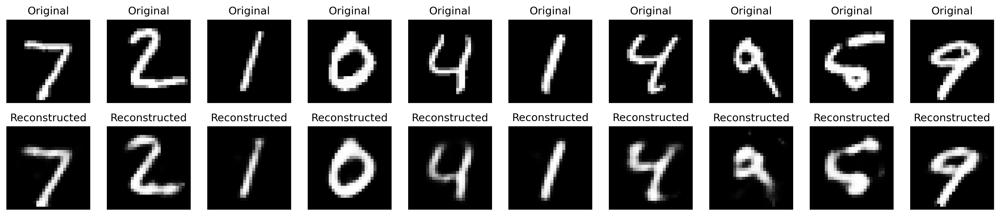

# Vanilla Autoencoder for MNIST Reconstruction

## Project Overview
A simple autoencoder implementation that compresses and reconstructs handwritten digits from the MNIST dataset. The model learns efficient latent representations through a bottleneck architecture.

## Key Components

### 1. Model Architecture
- **Encoder**: 
  - Input: 28×28 grayscale image (784 pixels)
  - Layers: Flatten → Dense(128, ReLU) → Dense(32, ReLU) 
  - Output: 32-dimensional latent space

- **Decoder**:
  - Input: 32D latent vector
  - Layers: Dense(128, ReLU) → Dense(784, Sigmoid) → Reshape(28×28)
  - Output: Reconstructed image

### 2. Training Process
- **Dataset**: 60,000 MNIST training images
- **Parameters**:
  - Epochs: 20
  - Batch size: 256
  - Loss: Mean Squared Error (MSE)
  - Optimizer: Adam
- **Validation**: 10,000 test images
- **Callbacks**:
  - Model checkpointing
  - Early stopping

### 3. File Structure

<pre>
autoencoders-phase1/
├── README.md
├── LICENSE
├── logging_config.py
├── log_file/
│   └── autoencoders-phase1.log
└── vanilla_autoencoder/
    ├── main.py
    ├── model.py
    ├── README.md
    ├── train.py
    └── utils.py
</pre>

### 4. Sample Outputs
The model achieves:
- Typical validation loss: ~0.02
- Clear digit reconstructions (see PNG)
- Effective 95% dimensionality reduction (784→32)

#### Log File Content

<pre>
2025-03-29 22:41:10,619 - INFO ->>> Logging initialized. Logs will be saved to: /home/vijay/my_github_projects/autoencoders-phase1/log_file/autoencoder-phase1.log
2025-03-29 22:41:12,254 - INFO ->>> Staring Vanilla Auto Encoding ...
2025-03-29 22:41:12,254 - INFO ->>> Load and Prepare Data
2025-03-29 22:41:12,612 - INFO ->>> Model setup: Latent Dimension as 32
2025-03-29 22:41:12,613 - INFO ->>> Initializing Vanilla Auto Encoder ...
2025-03-29 22:41:41,852 - INFO ->>> [WSL NOTE] Plot saved to 'reconstructions.png' (use an image viewer)
2025-03-29 22:41:41,853 - INFO ->>> Successfully Completed Vanilla Auto Encoding.
2025-03-29 22:50:47,549 - INFO ->>> Logging initialized. Logs will be saved to: /home/vijay/my_github_projects/autoencoders-phase1/log_file/autoencoder-phase1.log
2025-03-29 22:50:50,553 - INFO ->>> Staring Vanilla Auto Encoding ...
2025-03-29 22:50:50,553 - INFO ->>> Starting MNIST Autoencoder Training
2025-03-29 22:50:50,553 - INFO ->>> Configuration: Epochs=20, Batch Size=256, Latent Dim=32
2025-03-29 22:50:50,924 - INFO ->>> Loaded MNIST data: 60000 training, 10000 test samples
2025-03-29 22:50:50,924 - INFO ->>> Model setup: Latent Dimension as 32
2025-03-29 22:50:50,925 - INFO ->>> Initializing Vanilla Auto Encoder ...
2025-03-29 22:50:50,963 - INFO ->>> Model initialized and compiled
2025-03-29 22:50:53,303 - INFO ->>> Epoch 1/20 - loss: 0.0591 - val_loss: 0.0336
2025-03-29 22:50:54,572 - INFO ->>> Epoch 2/20 - loss: 0.0265 - val_loss: 0.0211
2025-03-29 22:50:55,804 - INFO ->>> Epoch 3/20 - loss: 0.0195 - val_loss: 0.0173
2025-03-29 22:50:57,055 - INFO ->>> Epoch 4/20 - loss: 0.0168 - val_loss: 0.0154
2025-03-29 22:50:58,270 - INFO ->>> Epoch 5/20 - loss: 0.0152 - val_loss: 0.0141
2025-03-29 22:50:59,484 - INFO ->>> Epoch 6/20 - loss: 0.0140 - val_loss: 0.0131
2025-03-29 22:51:00,718 - INFO ->>> Epoch 7/20 - loss: 0.0131 - val_loss: 0.0124
2025-03-29 22:51:01,908 - INFO ->>> Epoch 8/20 - loss: 0.0125 - val_loss: 0.0120
2025-03-29 22:51:03,109 - INFO ->>> Epoch 9/20 - loss: 0.0120 - val_loss: 0.0115
2025-03-29 22:51:04,337 - INFO ->>> Epoch 10/20 - loss: 0.0116 - val_loss: 0.0112
2025-03-29 22:51:05,634 - INFO ->>> Epoch 11/20 - loss: 0.0113 - val_loss: 0.0110
2025-03-29 22:51:06,839 - INFO ->>> Epoch 12/20 - loss: 0.0110 - val_loss: 0.0107
2025-03-29 22:51:08,043 - INFO ->>> Epoch 13/20 - loss: 0.0108 - val_loss: 0.0105
2025-03-29 22:51:09,301 - INFO ->>> Epoch 14/20 - loss: 0.0106 - val_loss: 0.0103
2025-03-29 22:51:10,679 - INFO ->>> Epoch 15/20 - loss: 0.0104 - val_loss: 0.0101
2025-03-29 22:51:12,044 - INFO ->>> Epoch 16/20 - loss: 0.0103 - val_loss: 0.0099
2025-03-29 22:51:13,343 - INFO ->>> Epoch 17/20 - loss: 0.0101 - val_loss: 0.0098
2025-03-29 22:51:14,610 - INFO ->>> Epoch 18/20 - loss: 0.0100 - val_loss: 0.0097
2025-03-29 22:51:15,844 - INFO ->>> Epoch 19/20 - loss: 0.0098 - val_loss: 0.0096
2025-03-29 22:51:17,076 - INFO ->>> Epoch 20/20 - loss: 0.0097 - val_loss: 0.0095
2025-03-29 22:51:17,100 - INFO ->>> Training completed. Final val_loss: 0.0095
2025-03-29 22:51:17,870 - INFO ->>> [WSL NOTE] Plot saved to 'reconstructions.png' (use an image viewer)
2025-03-29 22:51:17,870 - INFO ->>> Reconstructions saved to reconstructions.png
2025-03-29 22:51:17,871 - INFO ->>> Training history saved to vanilla_ae_history.pkl
2025-03-29 22:51:17,872 - INFO ->>> Successfully Completed Vanilla Auto Encoding.
</pre>

## How to Use
1. Install dependencies: `pip install tensorflow matplotlib numpy`
2. Run: `python main.py`
3. View results:
   - Training logs in `log_file/`
   - Reconstructions in `reconstructions.png`
   - Model weights in `vanilla_ae.weights.h5`

## Technical Notes
- Compatible with WSL (plots auto-save)
- CPU/GPU compatible
- Logs include timing and validation metrics

## License

This project is licensed under the GPL-3.0 license
