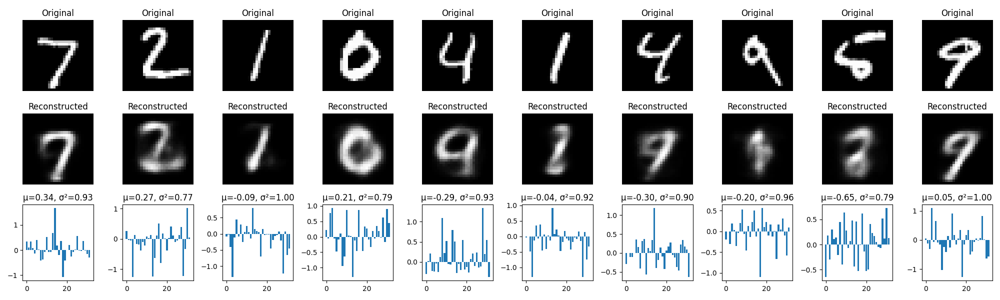

[Back Home](../README.md)

# Variational Autoencoder (VAE) for MNIST

This project implements a Variational Autoencoder (VAE) using TensorFlow/Keras to learn a compressed representation of the MNIST handwritten digit dataset. The VAE is trained to reconstruct input images while learning a meaningful latent space distribution.



## Output Log

<pre>
2025-03-30 15:08:22,597 - INFO ->>> Logging initialized. Logs will be saved to: /home/vijay/my_github_projects/autoencoders-phase1/log_file/autoencoder-phase1.log
2025-03-30 15:08:24,216 - INFO ->>> Staring Variational Auto Encoding ...
2025-03-30 15:08:24,580 - INFO ->>> Input shape: (60000, 28, 28, 1)
2025-03-30 15:08:27,054 - INFO ->>> Epoch 1/30, Rec Loss: 0.0926, KL Loss: 1.7415, Val Loss: 0.2046
2025-03-30 15:08:29,068 - INFO ->>> Epoch 2/30, Rec Loss: 0.0516, KL Loss: 1.0626, Val Loss: 0.1417
2025-03-30 15:08:31,135 - INFO ->>> Epoch 3/30, Rec Loss: 0.0419, KL Loss: 0.8275, Val Loss: 0.1157
2025-03-30 15:08:33,129 - INFO ->>> Epoch 4/30, Rec Loss: 0.0379, KL Loss: 0.6992, Val Loss: 0.1016
2025-03-30 15:08:35,219 - INFO ->>> Epoch 5/30, Rec Loss: 0.0359, KL Loss: 0.6175, Val Loss: 0.0933
2025-03-30 15:08:37,234 - INFO ->>> Epoch 6/30, Rec Loss: 0.0349, KL Loss: 0.5554, Val Loss: 0.0870
2025-03-30 15:08:39,400 - INFO ->>> Epoch 7/30, Rec Loss: 0.0345, KL Loss: 0.5028, Val Loss: 0.0815
2025-03-30 15:08:41,490 - INFO ->>> Epoch 8/30, Rec Loss: 0.0343, KL Loss: 0.4588, Val Loss: 0.0776
2025-03-30 15:08:43,659 - INFO ->>> Epoch 9/30, Rec Loss: 0.0343, KL Loss: 0.4221, Val Loss: 0.0737
2025-03-30 15:08:45,716 - INFO ->>> Epoch 10/30, Rec Loss: 0.0345, KL Loss: 0.3891, Val Loss: 0.0713
2025-03-30 15:08:47,742 - INFO ->>> Epoch 11/30, Rec Loss: 0.0347, KL Loss: 0.3607, Val Loss: 0.0686
2025-03-30 15:08:49,850 - INFO ->>> Epoch 12/30, Rec Loss: 0.0349, KL Loss: 0.3383, Val Loss: 0.0668
2025-03-30 15:08:51,977 - INFO ->>> Epoch 13/30, Rec Loss: 0.0351, KL Loss: 0.3183, Val Loss: 0.0652
2025-03-30 15:08:54,012 - INFO ->>> Epoch 14/30, Rec Loss: 0.0354, KL Loss: 0.3013, Val Loss: 0.0637
2025-03-30 15:08:56,069 - INFO ->>> Epoch 15/30, Rec Loss: 0.0357, KL Loss: 0.2874, Val Loss: 0.0630
2025-03-30 15:08:58,242 - INFO ->>> Epoch 16/30, Rec Loss: 0.0360, KL Loss: 0.2740, Val Loss: 0.0619
2025-03-30 15:09:00,344 - INFO ->>> Epoch 17/30, Rec Loss: 0.0363, KL Loss: 0.2616, Val Loss: 0.0612
2025-03-30 15:09:02,394 - INFO ->>> Epoch 18/30, Rec Loss: 0.0367, KL Loss: 0.2508, Val Loss: 0.0599
2025-03-30 15:09:04,452 - INFO ->>> Epoch 19/30, Rec Loss: 0.0370, KL Loss: 0.2402, Val Loss: 0.0599
2025-03-30 15:09:06,522 - INFO ->>> Epoch 20/30, Rec Loss: 0.0374, KL Loss: 0.2304, Val Loss: 0.0592
2025-03-30 15:09:08,643 - INFO ->>> Epoch 21/30, Rec Loss: 0.0378, KL Loss: 0.2211, Val Loss: 0.0583
2025-03-30 15:09:10,755 - INFO ->>> Epoch 22/30, Rec Loss: 0.0381, KL Loss: 0.2116, Val Loss: 0.0581
2025-03-30 15:09:12,778 - INFO ->>> Epoch 23/30, Rec Loss: 0.0385, KL Loss: 0.2039, Val Loss: 0.0577
2025-03-30 15:09:14,979 - INFO ->>> Epoch 24/30, Rec Loss: 0.0390, KL Loss: 0.1958, Val Loss: 0.0573
2025-03-30 15:09:17,040 - INFO ->>> Epoch 25/30, Rec Loss: 0.0394, KL Loss: 0.1882, Val Loss: 0.0573
2025-03-30 15:09:19,064 - INFO ->>> Epoch 26/30, Rec Loss: 0.0398, KL Loss: 0.1809, Val Loss: 0.0566
2025-03-30 15:09:21,343 - INFO ->>> Epoch 27/30, Rec Loss: 0.0402, KL Loss: 0.1747, Val Loss: 0.0567
2025-03-30 15:09:23,540 - INFO ->>> Epoch 28/30, Rec Loss: 0.0406, KL Loss: 0.1681, Val Loss: 0.0564
2025-03-30 15:09:25,762 - INFO ->>> Epoch 29/30, Rec Loss: 0.0411, KL Loss: 0.1618, Val Loss: 0.0564
2025-03-30 15:09:27,837 - INFO ->>> Epoch 30/30, Rec Loss: 0.0415, KL Loss: 0.1558, Val Loss: 0.0560
2025-03-30 15:09:29,268 - INFO ->>> Successfully Completed Variational Auto Encoding.
</pre>

## Project Structure

<pre>
autoencoders-phase1/
│
├── variational_autoencoder/
| ├── README.md # This file
│ ├── vae_model.py # VAE model architecture
│ ├── vae_train.py # Training script
│ ├── vae_utils.py # Utility functions (loss, plotting)
│ └── vae_main.py # Main entry point
│
└── logging_config.py # Logging configuration
</pre>


## Key Features

- Implements the VAE architecture with:
  - Encoder network that outputs mean (μ) and log variance (log σ²)
  - Reparameterization trick for differentiable sampling
  - Decoder network that reconstructs images from latent space
- Custom training loop with:
  - KL divergence annealing (gradually increasing KL weight)
  - Separate reconstruction and KL loss tracking
- Visualization of:
  - Original vs reconstructed images
  - Latent space statistics (μ and σ²)

## Requirements

- Python 3.10+
- TensorFlow 2.x
- NumPy
- Matplotlib

## Installation

1. Clone the repository:

   ```bash
   git clone https://github.com/yourusername/autoencoders-phase1.git
   cd autoencoders-phase1